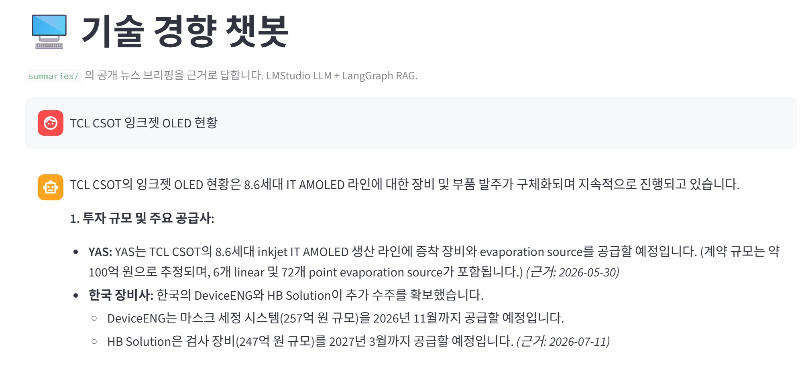

# Display Panel News

디스플레이 패널 제조사, 패널 구매 기업, 플랫폼 생태계 기업, 주요 공급망, 그리고 디스플레이 관련 연구 동향을 정리하는 공개 뉴스 브리핑 저장소입니다.

브리핑은 공개 웹 자료를 기준으로 작성하며, 각 항목에는 원문 링크를 함께 남깁니다.

## 정리 범위

- 패널 제조사: LG Display, Samsung Display, BOE, TCL CSOT, Tianma, Everdisplay, Visionox 등
- 패널 구매 기업: Apple, Samsung Electronics, LG Electronics, Hyundai Motor Group / Kia, Meta, Valve 등
- 플랫폼 생태계: Intel, NVIDIA 등 디스플레이 사양이나 로드맵에 영향을 줄 수 있는 플랫폼 기업
- 공급망: DDI, Micro-OLED backplane, 소재, 장비, 규제, 관련 부품 및 업체
- 연구 동향: 논문, preprint, 대학 및 연구기관 발표 자료 중 디스플레이 응용이 명확한 자료. OLED/microLED 같은 발광소자뿐 아니라 a-IGZO/IGZO TFT, oxide TFT, LTPO/backplane, encapsulation, color conversion, stretchable display, AR/VR microdisplay, display manufacturing 연구도 포함합니다. 단, IGZO/oxide semiconductor 항목은 TFT 또는 thin-film transistor 등 소자 용어와 display, panel, backplane, pixel, OLED, LCD, AMOLED, microdisplay, active matrix 같은 디스플레이 앵커가 함께 확인될 때만 포함합니다.

## 폴더 구조

- `summaries/<월>/`: 일간 뉴스 요약 파일
- `trends/weekly/`: 주간 경향 요약
- `trends/monthly/`: 월간 산업 및 연구 경향 요약
- `app/`: 요약 뉴스 기반 로컬 챗봇 웹앱 (Streamlit + LMStudio, 선택 사항)
- `docs/images/`: 문서용 이미지

예시:

```text
summaries/5월/
summaries/6월/
trends/weekly/
trends/monthly/
```

## 작성 형식

일간 요약은 한국어 Markdown으로 작성하며, 일반적으로 다음 구조를 사용합니다.

1. `핵심 요약`
2. `패널 메이커 신규 기사`
3. `Panel buyers 동향`
4. `Platform ecosystem`
5. 공급망 또는 규제 관련 섹션
6. `기술 논문 / 연구 동향`

해당 날짜에 의미 있는 내용이 없는 섹션은 표시하지 않습니다. `기술 논문 / 연구 동향`은 매주 일요일 또는 월간/분기/반기/연간 경향 정리일에 필요한 경우에만 포함합니다.

기사 링크는 각 bullet 바로 아래에 둡니다.

```md
- Tianma는 Intel Client Ecosystem Symposium / Edge Solution Summit 2026 Shanghai에서 노트북용 IT display 2종을 공개했습니다. (TweakTown, 2026년 5월 23일)
  원문: https://...
  교차 확인: https://...
```

`교차 확인`은 유용한 2차 출처가 있을 때만 표시합니다.

## 운영 원칙

- 공개 웹 자료만 사용합니다.
- 중복 기사나 실질적으로 같은 내용은 반복해서 신규 항목으로 넣지 않습니다.
- 하루 이상 파일 생성이 누락된 경우, 다음 생성 파일에는 마지막 생성 기준 시각 이후부터 현재 기준 시각까지의 의미 있는 신규/비중복 항목을 포함할 수 있습니다.
- 누락된 날짜에 대해 빈 파일을 별도로 생성하지 않습니다.
- 회사별 섹션은 뉴스 가치가 있는 항목이 있을 때만 표시합니다.
- 연구 자료는 회사 뉴스와 구분해서 다루며, 디스플레이 응용이 명확한 경우에만 포함합니다.
- IGZO가 DRAM, 3D NAND, embedded memory, neuromorphic memory, BEOL logic, power electronics, sensor 등 비디스플레이 응용으로만 제시된 논문은 제외합니다.
- ACS ASAP 등 출판사 페이지가 검색엔진에 늦게 반영되거나 접근 제한이 있을 수 있으므로, 일요일 연구 조사에서는 Crossref, OpenAlex, PubMed 같은 DOI/논문 메타데이터 경로로도 제목·DOI·초록을 확인합니다.

## 뉴스 챗봇 웹앱 (Streamlit + LMStudio)

`summaries/`에 쌓인 뉴스 브리핑을 근거로 대화할 수 있는 로컬 챗봇 웹앱을 `app/`에 포함하고 있습니다.

- UI: Streamlit 채팅 인터페이스
- LLM: LMStudio 로컬 서버 (OpenAI 호환 API, 다른 PC의 서버로 교체 가능)
- 검색: 로컬 임베딩 + FAISS 기반 RAG
- 파이프라인: LangGraph — `panel_maker` / `buyer` / `vendor` 노드가 각자 해당 카테고리 뉴스만 검색한 뒤 근거 기반으로 답변하고, 참고한 뉴스의 원문 링크를 함께 표시합니다.

실행 예시:



설치와 실행 방법, LLM/임베딩 교체 방법은 [app/README.md](app/README.md)를 참고하세요.

```powershell
pip install -r app/requirements.txt
python -m streamlit run app/app.py
```

새 브리핑 파일을 추가한 뒤에는 `python app/build_index.py`로 검색 인덱스를 갱신할 수 있으며, Codex 자동화의 마지막 단계에도 이 갱신이 포함되어 있습니다.

## 참고

이 저장소의 내용은 공개 자료 기반의 개인 리서치 정리입니다. 특정 회사, 기관, 제품에 대한 투자 의견이나 공식 입장을 의미하지 않습니다.

## Codex 설정 팩

`codex-setup/`은 Codex에서 공개 디스플레이 패널 뉴스 브리핑을 만들 때 사용하는
설정 모음입니다. 브리핑 작성 기준, 반복 실행 프롬프트, 출력 템플릿을 함께 두어
다른 Codex 세션에서도 같은 기준으로 결과를 만들 수 있게 합니다.

주요 내용은 다음과 같습니다.

- 공개 자료 중심의 소스, 카테고리, 작성 주기 설정
- 일간 브리핑, 일요일 연구 동향, 월간 트렌드, 자동화 설정용 프롬프트
- Markdown 출력 템플릿과 예시 요청문
- 공개 URL 및 검색 쿼리 참고 자료

다음과 같은 경우 `codex-setup/`을 사용합니다.

- 새 Codex 세션에서 일간 브리핑을 생성할 때
- 반복 자동화를 설정할 때
- 일요일 연구 동향이나 월간 트렌드 정리를 추가할 때
- 회사 중립적인 공개 워크플로를 공유할 때

`codex-setup/`에는 공개해도 되는 일반 규칙만 둡니다. 개인 이메일, API key,
수신자 목록, 비공개 소스 우선순위, 로컬 캐시, 모델/벡터 인덱스, 로그는 공개
저장소에 넣지 말고 `codex-local/`처럼 커밋하지 않는 경로에 보관합니다.

일회성 브리핑을 만들 때는 Codex에 다음처럼 요청할 수 있습니다.

```text
codex-setup/README.md와 config, prompts, templates, reference 아래의 관련 파일을 읽어 주세요.

공개 자료만 사용해 오늘 날짜의 한국어 디스플레이 패널 뉴스 브리핑을 생성하고
summaries/<month_ko>/YYYY-MM-DD.md에 저장해 주세요.

제가 명시적으로 승인하기 전에는 이메일 발송, commit, push를 하지 마세요.
```

반복 자동화 설정은 `codex-setup/prompts/setup_automation_ko.md` 또는
`codex-setup/examples/sample_automation_setup_request.md`를 기준으로 시작합니다.
